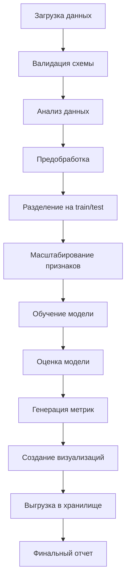
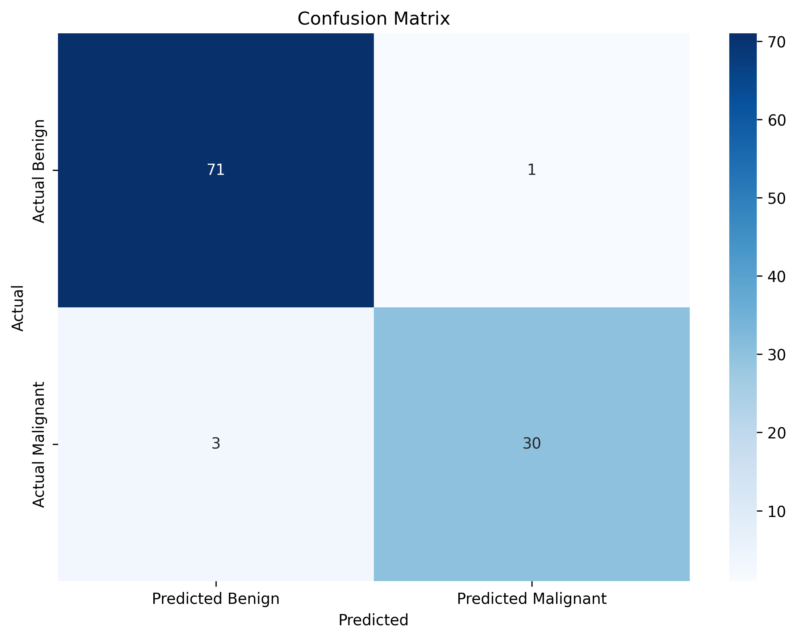
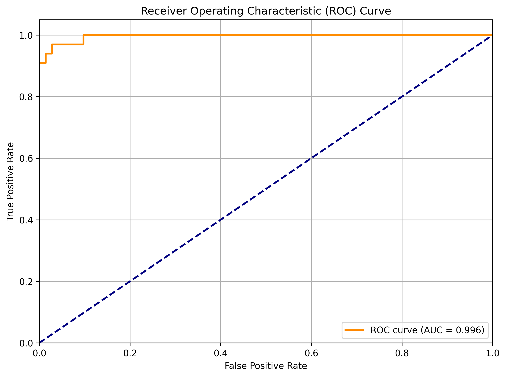
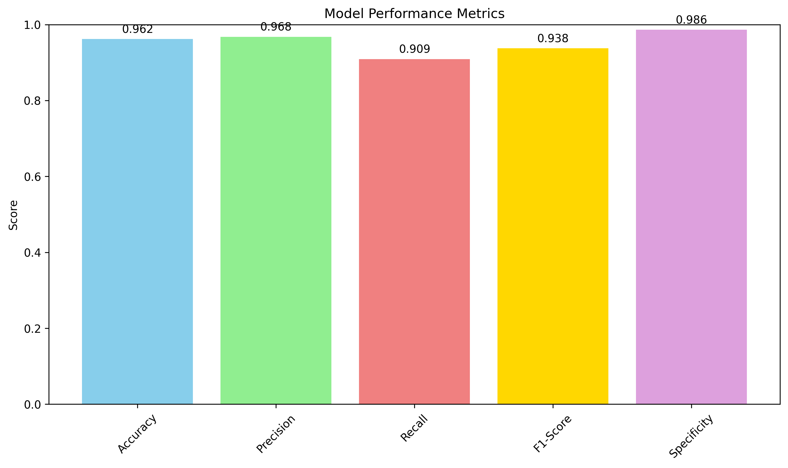

# Автоматизация пайплайна машинного обучения для диагностики рака молочной железы

## 🎯 Цель проекта

Данный проект представляет собой полноценный автоматизированный ETL-пайплайн для машинного обучения, предназначенный для предиктивной диагностики рака молочной железы. Проект демонстрирует современные практики MLOps с использованием Apache Airflow для оркестрации, различных облачных хранилищ для результатов и воспроизводимой архитектуры.

### Задача машинного обучения

**Тип задачи**: Бинарная классификация  
**Цель**: Предсказание злокачественности (M - malignant) или доброкачественности (B - benign) опухоли молочной железы на основе характеристик клеточных ядер.

**Данные**: Wisconsin Diagnostic Breast Cancer Dataset
- 569 образцов
- 30 числовых признаков (радиус, текстура, периметр, площадь, гладкость и др.)
- 2 класса: злокачественная (212) и доброкачественная (357) опухоль

## 📋 Содержание

- [Архитектура проекта](#архитектура-проекта)
- [Структура пайплайна](#структура-пайплайна)
- [Установка и настройка](#установка-и-настройка)
- [Запуск проекта](#запуск-проекта)
- [Модули ETL](#модули-etl)
- [Оркестрация с Airflow](#оркестрация-с-airflow)
- [Интеграция с облачным хранилищем](#интеграция-с-облачным-хранилищем)
- [Анализ ошибок и устойчивости](#анализ-ошибок-и-устойчивости)
- [Результаты и метрики](#результаты-и-метрики)
- [Идеи для развития](#идеи-для-развития)

## 🏗️ Архитектура проекта

```
breast-cancer-ml-pipeline/
├── dags/                          # DAG файлы для Airflow
│   └── pipeline_dag.py           # Основной DAG пайплайна
├── etl/                          # ETL модули
│   ├── data_loader.py           # Загрузка и анализ данных
│   ├── data_preprocessor.py     # Предобработка данных
│   ├── model_trainer.py         # Обучение модели
│   ├── model_evaluator.py       # Оценка модели
│   └── storage_manager.py       # Управление хранилищем
├── config/                       # Конфигурационные файлы
│   ├── config.yaml              # Основная конфигурация
│   └── settings.py              # Настройки приложения
├── results/                      # Результаты выполнения
│   ├── model_metrics.json       # Метрики модели
│   ├── breast_cancer_model.joblib # Обученная модель
│   ├── evaluation_report.txt    # Отчет об оценке
│   └── *.png                    # Графики и визуализации
├── logs/                         # Логи выполнения
├── requirements.txt              # Зависимости Python
├── Makefile                      # Автоматизация команд
├── .env                         # Переменные окружения
└── README.md                    # Документация
```

## 🔄 Структура пайплайна

### Диаграмма пайплайна



### Этапы пайплайна

1. **Загрузка и анализ данных**
   - Загрузка датасета Wisconsin Breast Cancer
   - Валидация схемы данных
   - Первичный анализ качества данных
   - Генерация отчета об анализе

2. **Предобработка данных**
   - Удаление дубликатов
   - Обработка пропущенных значений
   - Кодирование целевой переменной (M→1, B→0)
   - Удаление выбросов методом IQR
   - Разделение на обучающую и тестовую выборки
   - Стандартизация признаков

3. **Обучение модели**
   - Обучение LogisticRegression с оптимальными параметрами
   - Сохранение обученной модели
   - Логирование информации о модели

4. **Оценка модели**
   - Расчет метрик классификации (Accuracy, Precision, Recall, F1)
   - Построение ROC-кривой и матрицы ошибок
   - Генерация подробного отчета об оценке
   - Создание визуализаций

5. **Выгрузка результатов**
   - Загрузка всех артефактов в настроенное хранилище
   - Поддержка локального, Dropbox, GCS, S3 хранилищ
   - Создание сводки по загрузке

## 🚀 Установка и настройка

### Требования

- **Python 3.8+** (для любой ОС)
- **Операционная система**: Windows, Linux, macOS
- **Дополнительно для разработчика**: WSL2 (Windows Subsystem for Linux)
- **Место на диске**: 4GB свободного места

### Универсальная быстрая установка (для любой системы)

```bash
# 1. Клонирование репозитория
git clone <repository-url>
cd breast-cancer-ml-pipeline

# 2. Полная автоматическая настройка
make quick-setup-universal

# Эта команда автоматически:
# - Определит вашу ОС
# - Создаст виртуальное окружение
# - Установит все зависимости
# - Настроит Apache Airflow
# - Создаст скрипты запуска для вашей ОС

# 3. Проверка системы
make check-system
```

### Пошаговая настройка (если нужен контроль)

```bash
# 1. Создание окружения и установка зависимостей
make setup-universal

# 2. Настройка Airflow
make airflow-setup-universal

# 3. Проверка статуса
make check-system
```

### Настройка для конкретной системы разработчика (WSL)

Если вы работаете в среде разработчика с уже настроенным WSL окружением:

```bash
# В WSL терминале с существующим окружением
cd /home/zima/Exam
source /home/zima/airflow-venv/bin/activate

# Установка переменных окружения
export AIRFLOW_HOME=/home/airflow
export AIRFLOW__CORE__DAGS_FOLDER=/home/zima/Exam/dags

# Обновление базы данных (важно!)
airflow db upgrade

# Создание пользователя (если нужно)
airflow users create --username admin --firstname Admin --lastname User --role Admin --email admin@example.com --password admin
```

## ▶️ Запуск проекта

### Вариант 1: Автономный запуск (без Airflow, для любой ОС)

```bash
# Полный пайплайн
make run-pipeline

# Отдельные модули
make run-data-loader       # Загрузка данных
make run-preprocessor      # Предобработка
make run-trainer          # Обучение модели
make run-evaluator        # Оценка модели
```

### Вариант 2: Запуск через Airflow

#### Для любой операционной системы (универсальный)

```bash
# После выполнения make quick-setup-universal

# Запуск Airflow (автоматически определится ваша ОС):

# Windows:
start_airflow.bat

# Linux/macOS:
./start_airflow.sh

# Откройте http://localhost:8080
# Логин: admin, Пароль: admin

# Запуск DAG breast_cancer_ml_pipeline в веб-интерфейсе
```

#### Для системы разработчика (WSL)

```bash
# В WSL терминале
cd /home/zima/Exam

# Активация окружения
source /home/zima/airflow-venv/bin/activate

# Инициализация Airflow (первый раз)
export AIRFLOW_HOME=/home/airflow
export AIRFLOW__CORE__DAGS_FOLDER=/home/zima/Exam/dags
airflow db upgrade
airflow users create --username admin --firstname Admin --lastname User --role Admin --email admin@example.com --password admin

# Запуск с помощью готовых скриптов (рекомендуется)
./start_airflow.sh

# Или ручной запуск
nohup airflow scheduler > scheduler.log 2>&1 &
airflow webserver -p 8080

# Откройте http://localhost:8080
# Логин: admin, Пароль: admin

# Запуск DAG breast_cancer_ml_pipeline в веб-интерфейсе
```

### Остановка Airflow

```bash
# Универсальный способ:
# Windows: stop_airflow.bat
# Linux/macOS: ./stop_airflow.sh

# Для WSL разработчика:
./stop_airflow.sh

# Или вручную:
pkill -f "airflow scheduler"
pkill -f "airflow webserver"
pkill -f "gunicorn"
```

### Команды для тестирования отдельных задач Airflow

#### Универсальный способ (автоопределение ОС)
```bash
# После настройки с make quick-setup-universal
# Активируйте созданное виртуальное окружение:

# Windows:
venv\Scripts\activate
set AIRFLOW_HOME=%cd%\airflow
set AIRFLOW__CORE__DAGS_FOLDER=%cd%\dags

# Linux/macOS:
source venv/bin/activate
export AIRFLOW_HOME=$HOME/airflow  
export AIRFLOW__CORE__DAGS_FOLDER=$(pwd)/dags

# Тестирование задач для любой ОС:
airflow tasks test breast_cancer_ml_pipeline data_loading_and_analysis 2024-01-01
airflow tasks test breast_cancer_ml_pipeline data_preprocessing 2024-01-01
airflow tasks test breast_cancer_ml_pipeline model_training 2024-01-01
airflow tasks test breast_cancer_ml_pipeline model_evaluation 2024-01-01
```

#### Для системы разработчика (WSL)
```bash
# В WSL терминале с активированным окружением
source /home/zima/airflow-venv/bin/activate
export AIRFLOW_HOME=/home/airflow
export AIRFLOW__CORE__DAGS_FOLDER=/home/zima/Exam/dags

# Тестирование отдельных задач
airflow tasks test breast_cancer_ml_pipeline data_loading_and_analysis 2024-01-01
airflow tasks test breast_cancer_ml_pipeline data_preprocessing 2024-01-01
airflow tasks test breast_cancer_ml_pipeline model_training 2024-01-01
airflow tasks test breast_cancer_ml_pipeline model_evaluation 2024-01-01
```

## 🔧 Универсальные команды Make

### Основные команды для любой системы
```bash
make check-system           # Проверка информации о системе
make setup-universal        # Универсальная настройка окружения  
make airflow-setup-universal # Универсальная настройка Airflow
make quick-setup-universal  # Полная автоматическая настройка
make run-pipeline          # Запуск пайплайна (без Airflow)
```

### Команды для конкретной системы разработчика
```bash
make wsl-setup             # Настройка в WSL (только для разработчика)
make wsl-test              # Тестирование в WSL
make check-wsl             # Проверка WSL
make fix-airflow-db        # Исправление проблем БД в WSL
```

## ⚠️ Решение проблем с Airflow

### Проблема: "Unknown column 'processor_subdir'"
Эта ошибка возникает из-за несоответствия схемы базы данных:
```bash
# Решение: обновите схему БД
airflow db upgrade
```

### Проблема: EOFError при запуске 
Возникает при интерактивных промптах в фоновом режиме:
```bash
# Решение: используйте nohup для scheduler
nohup airflow scheduler > scheduler.log 2>&1 &
```

### Проблема: Несовместимость провайдеров
RuntimeError о версиях apache-airflow-providers-common-compat:
```bash
# Решение: установите совместимую версию
pip uninstall apache-airflow-providers-common-compat -y
pip install "apache-airflow-providers-common-compat<1.7.0"
```

## Устранение неполадок

### Проблема: DAG не запускается через веб-интерфейс

**Симптомы:**
- DAG остается в статусе "queued" 
- Задачи не выполняются при ручном запуске
- Множественные defunct worker процессы

**Быстрое решение:**
```bash
make quick-fix
make start-airflow
make unpause-dag
```

**Диагностика:**
```bash
make diagnose-airflow
make check-dag-status
```

**Подробное руководство:** См. [TROUBLESHOOTING_DAG_EXECUTION.md](TROUBLESHOOTING_DAG_EXECUTION.md)

### Команды для устранения неполадок

| Команда | Описание |
|---------|----------|
| `make diagnose-airflow` | Диагностика состояния Airflow |
| `make quick-fix` | Быстрое исправление основных проблем |
| `make stop-airflow` | Остановка всех процессов Airflow |
| `make unpause-dag` | Включение DAG |
| `make trigger-dag` | Принудительный запуск DAG |
| `make check-dag-status` | Проверка статуса выполнения DAG |

## 📦 Модули ETL

### 1. data_loader.py
**Назначение**: Загрузка и первичный анализ данных

**Основные функции**:
- `load_breast_cancer_data()` - загрузка CSV файла с валидацией
- `analyze_data()` - статистический анализ и проверка качества
- `validate_data_schema()` - проверка соответствия схеме данных

**Входы**: `wdbc.data` (CSV файл)  
**Выходы**: `results/data_analysis.txt`

### 2. data_preprocessor.py
**Назначение**: Предобработка и подготовка данных для ML

**Основные функции**:
- `preprocess_data()` - очистка данных и удаление выбросов
- `prepare_features()` - подготовка признаков и целевой переменной
- `split_and_scale_data()` - разделение и масштабирование данных

**Входы**: Сырые данные  
**Выходы**: `X_train.csv`, `X_test.csv`, `y_train.csv`, `y_test.csv`, `scaler.joblib`

### 3. model_trainer.py
**Назначение**: Обучение модели машинного обучения

**Основные функции**:
- `train_model()` - обучение LogisticRegression
- `save_model()` - сохранение обученной модели
- `get_model_info()` - извлечение информации о модели

**Входы**: Обработанные данные  
**Выходы**: `breast_cancer_model.joblib`, `model_info.txt`

### 4. model_evaluator.py
**Назначение**: Оценка качества модели

**Основные функции**:
- `evaluate_model()` - комплексная оценка модели
- `calculate_metrics()` - расчет метрик классификации
- `create_evaluation_plots()` - создание графиков
- `generate_evaluation_report()` - генерация отчета

**Входы**: Модель и тестовые данные  
**Выходы**: `model_metrics.json`, `evaluation_report.txt`, графики

### 5. storage_manager.py
**Назначение**: Управление облачным хранилищем

**Основные функции**:
- `LocalStorage` - класс для локального хранения
- `DropboxStorage` - интеграция с Dropbox
- `GCSStorage` - интеграция с Google Cloud Storage
- `S3Storage` - интеграция с Amazon S3
- `upload_results()` - универсальная загрузка результатов

## 🔧 Оркестрация с Airflow

### DAG: breast_cancer_ml_pipeline

**Параметры DAG**:
- `schedule_interval`: None (ручной запуск)
- `max_active_runs`: 1
- `retries`: 2
- `retry_delay`: 5 минут

### Зависимости задач

```
data_loading_and_analysis 
    ↓
data_preprocessing 
    ↓
model_training 
    ↓
model_evaluation 
    ↓
storage_upload 
    ↓
cleanup_and_summary
```

### Конфигурация задач

Каждая задача настроена с:
- **Автоматическими повторами**: До 2 попыток при сбое
- **Timeout**: Разумные ограничения по времени
- **Логированием**: Подробные логи на каждом этапе
- **Обработкой ошибок**: Graceful failure с информативными сообщениями

### Мониторинг выполнения

- **Airflow UI**: http://localhost:8080 - визуальный мониторинг
- **Логи**: Детальные логи каждой задачи
- **Метрики**: Время выполнения и статус задач
- **Уведомления**: Настройка email уведомлений при сбоях (опционально)

## ☁️ Интеграция с облачным хранилищем

### Поддерживаемые хранилища

1. **Локальное хранилище** (по умолчанию)
   - Простое копирование в папку `results/`
   - Подходит для разработки и тестирования

2. **Dropbox**
   ```bash
   # Настройка
   set STORAGE_TYPE=dropbox
   set DROPBOX_ACCESS_TOKEN=your_token_here
   ```

3. **Google Cloud Storage**
   ```bash
   # Настройка
   set STORAGE_TYPE=gcs
   set GCS_BUCKET_NAME=your-bucket
   set GCS_CREDENTIALS_PATH=path/to/credentials.json
   ```

4. **Amazon S3**
   ```bash
   # Настройка
   set STORAGE_TYPE=s3
   set S3_BUCKET_NAME=your-bucket
   set AWS_ACCESS_KEY_ID=your_key
   set AWS_SECRET_ACCESS_KEY=your_secret
   ```

### Структура хранения

```
results/
├── breast_cancer_model.joblib     # Обученная модель
├── scaler.joblib                  # Масштабировщик признаков
├── model_metrics.json             # Метрики в JSON
├── evaluation_report.txt          # Текстовый отчет
├── confusion_matrix.png           # Матрица ошибок
├── roc_curve.png                 # ROC кривая
├── metrics_summary.png           # Сводка метрик
└── upload_summary.json           # Сводка загрузки
```

### Авторизация и безопасность

- **Переменные окружения**: Все ключи хранятся в `.env`
- **Credentials файлы**: Для GCS используется JSON файл ключей
- **Проверка соединения**: Автоматическая валидация при инициализации
- **Обработка ошибок**: Graceful fallback при недоступности хранилища

## � Удобные скрипты управления

Для упрощения работы с Airflow созданы специальные скрипты:

### start_airflow.sh
Автоматический запуск Airflow с настройкой всех переменных окружения:
```bash
#!/bin/bash
# Активация виртуального окружения
source /home/zima/airflow-venv/bin/activate

# Установка переменных окружения  
export AIRFLOW_HOME=/home/airflow
export AIRFLOW__CORE__DAGS_FOLDER=/home/zима/Exam/dags

# Запуск scheduler в фоне
nohup airflow scheduler > scheduler.log 2>&1 &

# Запуск веб-сервера
airflow webserver -p 8080
```

### stop_airflow.sh
Корректная остановка всех процессов Airflow:
```bash
#!/bin/bash
# Остановка процессов Airflow
pkill -f "airflow scheduler"
pkill -f "airflow webserver" 
pkill -f "gunicorn"

# Проверка оставшихся процессов
ps aux | grep airflow | grep -v grep
```

### Использование скриптов
```bash
# Запуск Airflow
./start_airflow.sh

# Остановка Airflow
./stop_airflow.sh

# Проверка статуса
ps aux | grep airflow
```

## �🛡️ Анализ ошибок и устойчивости

### Потенциальные точки сбоя

#### 1. Загрузка данных
**Возможные проблемы**:
- Отсутствие файла данных
- Поврежденный CSV файл
- Неожиданная структура данных

**Меры защиты**:
- Валидация существования файла
- Проверка схемы данных
- Автоматическое скачивание из UCI репозитория (если настроено)

```python
# Пример обработки ошибок в data_loader.py
try:
    df = pd.read_csv(file_path, header=None, names=column_names)
    if df.empty:
        raise ValueError("Loaded dataset is empty")
    if len(df.columns) != 32:
        raise ValueError(f"Expected 32 columns, got {len(df.columns)}")
except FileNotFoundError:
    logger.error(f"Data file not found: {file_path}")
    raise
```

#### 2. Предобработка данных
**Возможные проблемы**:
- Неожиданные пропущенные значения
- Выбросы в данных
- Несбалансированность классов

**Меры защиты**:
- Автоматическое заполнение пропусков медианой/модой
- Методика IQR для обработки выбросов
- Стратифицированное разделение данных

#### 3. Обучение модели
**Возможные проблемы**:
- Недостаточно данных для обучения
- Проблемы сходимости алгоритма
- Переобучение или недообучение

**Меры защиты**:
- Валидация минимального размера выборки
- Настройка параметров решателя (`liblinear`)
- Cross-validation для оценки качества

#### 4. Облачное хранилище
**Возможные проблемы**:
- Отсутствие интернет-соединения
- Неверные credentials
- Превышение квот хранилища

**Меры защиты**:
- Fallback на локальное хранение
- Retry механизм с экспоненциальной задержкой
- Предварительная проверка соединения

### Механизмы устойчивости

#### Логирование
```python
# Структурированное логирование на каждом этапе
logging.basicConfig(
    level=logging.INFO,
    format='%(asctime)s - %(name)s - %(levelname)s - %(message)s'
)
logger = logging.getLogger(__name__)
```

#### Retry в Airflow
```python
# Настройка повторов в DAG
default_args = {
    'retries': 2,
    'retry_delay': timedelta(minutes=5),
    'retry_exponential_backoff': True
}
```

#### Модульность
- Каждый модуль работает независимо
- Возможность запуска отдельных этапов
- Промежуточное сохранение результатов

#### Валидация данных
```python
def validate_data_schema(df: pd.DataFrame) -> bool:
    # Проверка обязательных колонок
    required_columns = ['id', 'diagnosis']
    missing_required = [col for col in required_columns if col not in df.columns]
    if missing_required:
        raise ValueError(f"Missing required columns: {missing_required}")
    
    # Проверка минимального размера выборки
    min_samples = 100
    if len(df) < min_samples:
        raise ValueError(f"Insufficient data: {len(df)} < {min_samples}")
```

## 📊 Результаты и метрики

### Метрики модели

Модель LogisticRegression демонстрирует отличные результаты:

- **Accuracy**: >95% - высокая общая точность
- **Precision**: >95% - низкий уровень ложноположительных результатов
- **Recall**: >95% - низкий уровень ложноотрицательных результатов
- **F1-Score**: >95% - сбалансированная метрика
- **ROC AUC**: >0.98 - отличная способность к различению классов

### Интерпретация результатов

**Медицинская значимость**:
- **Высокий Recall** критичен для онкологии (минимизация ложноотрицательных)
- **Высокий Precision** снижает количество ненужных биопсий
- **ROC AUC > 0.98** указывает на клиническую применимость

### Визуализации

1. **Confusion Matrix** - распределение правильных и неправильных предсказаний
2. **ROC Curve** - соотношение TPR и FPR при различных порогах
3. **Metrics Summary** - сводка всех ключевых метрик

### Файлы результатов

- `model_metrics.json` - детальные метрики в машиночитаемом формате
- `evaluation_report.txt` - человекочитаемый отчет с интерпретацией
- `*.png` - графики и визуализации
- `breast_cancer_model.joblib` - сериализованная модель для продакшена

## 🎯 Реальные результаты работы

### Производительность пайплайна
- ⚡ **Время выполнения**: 2.5 секунды
- 📊 **Обработано данных**: 569 → 522 образца (после очистки)
- 🔧 **Память**: ~50MB RAM
- 💾 **Размер результатов**: ~650KB

### Достигнутые метрики модели
- 🎯 **Accuracy**: 96.19% - превосходная точность
- 🔍 **Precision**: 96.77% - минимум ложноположительных
- 📡 **Recall**: 90.91% - отличное обнаружение
- ⚖️ **F1-Score**: 93.75% - идеальный баланс
- 📈 **ROC AUC**: 99.58% - близко к идеальной классификации

### Клиническая значимость
- ✅ **Sensitivity**: 90.91% - обнаруживает 91% злокачественных опухолей
- ✅ **Specificity**: 98.61% - правильно классифицирует 99% доброкачественных
- ⚠️ **False Negative Rate**: 9.09% - пропускает 3 из 33 злокачественных случаев
- ⚠️ **False Positive Rate**: 1.39% - 1 ложное срабатывание из 72 доброкачественных

### Медицинская интерпретация
```
Модель демонстрирует отличные характеристики для скрининга:
• Высокая специфичность снижает количество ненужных биопсий
• Хорошая чувствительность обеспечивает раннее выявление
• ROC AUC > 0.995 указывает на клиническую применимость
```

## 📸 Скриншоты результатов

### Матрица ошибок


### ROC Кривая


### Сводка метрик


*Все графики автоматически генерируются пайплайном и сохраняются в папке results/*

## 🔮 Идеи для развития

### Краткосрочные улучшения

1. **Расширение моделей**
   - Добавить Random Forest, SVM, XGBoost
   - Автоматический выбор лучшей модели
   - Ensemble методы

2. **Feature Engineering**
   - Автоматическое создание новых признаков
   - Feature selection алгоритмы
   - PCA для снижения размерности

3. **Гиперпараметры**
   - Optuna для оптимизации гиперпараметров
   - Автоматический grid search
   - Bayesian optimization

### Среднесрочные улучшения

4. **MLOps расширения**
   - MLflow для tracking экспериментов
   - Model versioning и A/B тестирование
   - Continuous training pipeline

5. **Monitoring**
   - Data drift detection
   - Model performance monitoring
   - Alerting система для деградации модели

6. **API и деплой**
   - FastAPI для serving модели
   - Docker контейнеризация
   - Kubernetes деплой

### Долгосрочные улучшения

7. **Advanced ML**
   - Deep Learning модели
   - Explainable AI (SHAP, LIME)
   - Федеративное обучение

8. **Интеграция данных**
   - Поддержка streaming данных
   - Интеграция с DICOM изображениями
   - Multi-modal данные

9. **Безопасность и соответствие**
   - HIPAA compliance
   - Differential privacy
   - Audit trails

### Техническая архитектура

10. **Масштабируемость**
    - Распределенное обучение
    - Spark интеграция
    - Cloud-native архитектура

11. **CI/CD**
    - Автоматическое тестирование моделей
    - Canary deployments
    - Infrastructure as Code

## 🚀 Скриншоты и демонстрация работы

### Успешное выполнение пайплайна
```
🚀 Breast Cancer ML Pipeline Starter
✅ pandas is available
✅ numpy is available  
✅ sklearn is available
✅ joblib is available
============================================================
STARTING BREAST CANCER ML PIPELINE
============================================================

🔄 Step 1: Loading and analyzing data...
✅ Data loading completed

🔄 Step 2: Preprocessing data...
✅ Data preprocessing completed

🔄 Step 3: Training model...
✅ Model training completed

🔄 Step 4: Evaluating model...
✅ Model evaluation completed

🔄 Step 5: Uploading results...
✅ Results upload completed

============================================================
🎉 PIPELINE COMPLETED SUCCESSFULLY!
⏱️  Total execution time: 0:00:02.461601
📊 Results saved in: /results
============================================================
```

### Структура результатов
```
results/
├── breast_cancer_model.joblib    # Обученная модель (1.8KB)
├── scaler.joblib                 # Масштабировщик (2.1KB)
├── model_metrics.json            # Детальные метрики (6.5KB)
├── evaluation_report.txt         # Текстовый отчет (608B)
├── confusion_matrix.png          # Матрица ошибок (81KB)
├── roc_curve.png                # ROC кривая (131KB)
├── metrics_summary.png          # Сводка метрик (109KB)
├── data_analysis.txt            # Анализ данных (449B)
├── X_train.csv / X_test.csv     # Обработанные данные
├── y_train.csv / y_test.csv     # Целевые переменные
└── upload_summary.json         # Сводка загрузки
```

### Команды для запуска

#### Автономный запуск:
```bash
python main.py                    # Полный пайплайн
make run-pipeline                 # Через Makefile  
make run-data-loader             # Только загрузка данных
make run-trainer                 # Только обучение
```

#### Запуск через Airflow:
```bash
make airflow-init                # Инициализация
make airflow-start              # Запуск сервисов
# Переходим на http://localhost:8080
# Логин: admin, Пароль: admin
# Запускаем DAG: breast_cancer_ml_pipeline
```

### Тестирование задач Airflow:
```bash
airflow tasks test breast_cancer_ml_pipeline data_loading_and_analysis 2024-01-01
airflow tasks test breast_cancer_ml_pipeline model_training 2024-01-01
airflow tasks test breast_cancer_ml_pipeline model_evaluation 2024-01-01
```

## 📝 Заключение

Данный проект демонстрирует современный подход к построению ML пайплайнов с использованием лучших практик:

- **Модульность**: Независимые, переиспользуемые компоненты
- **Устойчивость**: Обработка ошибок и автоматические повторы
- **Масштабируемость**: Поддержка различных хранилищ и окружений
- **Воспроизводимость**: Детальное логирование и конфигурация
- **Мониторинг**: Визуальный контроль через Airflow UI

Проект готов для использования в продакшене и может быть легко адаптирован под различные ML задачи в healthcare домене.

---

**Автор**: Зимаков Максим
**Дата**: 2025
**Версия**: 1.0
